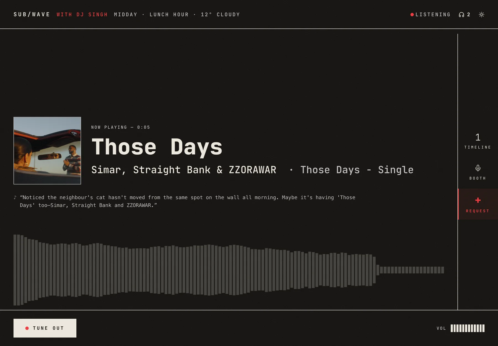
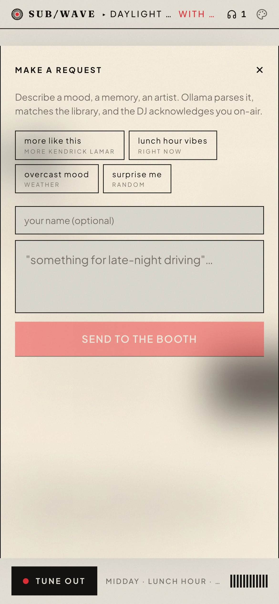
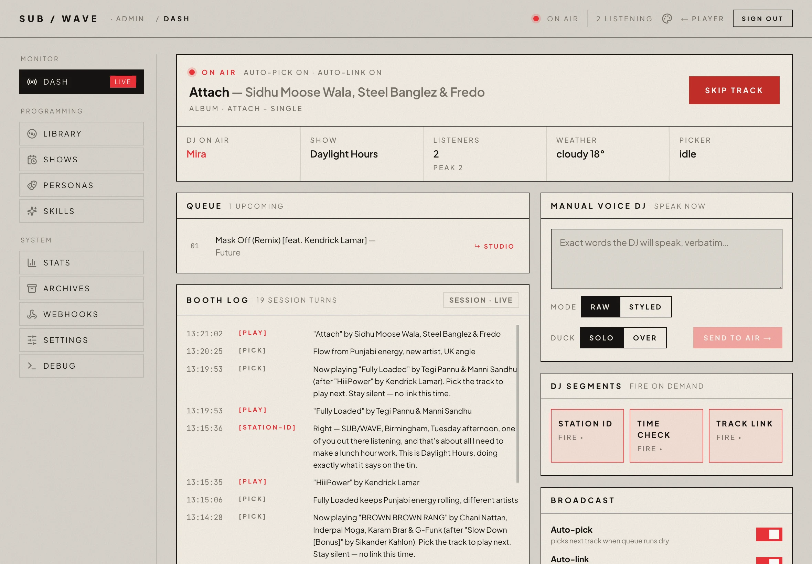
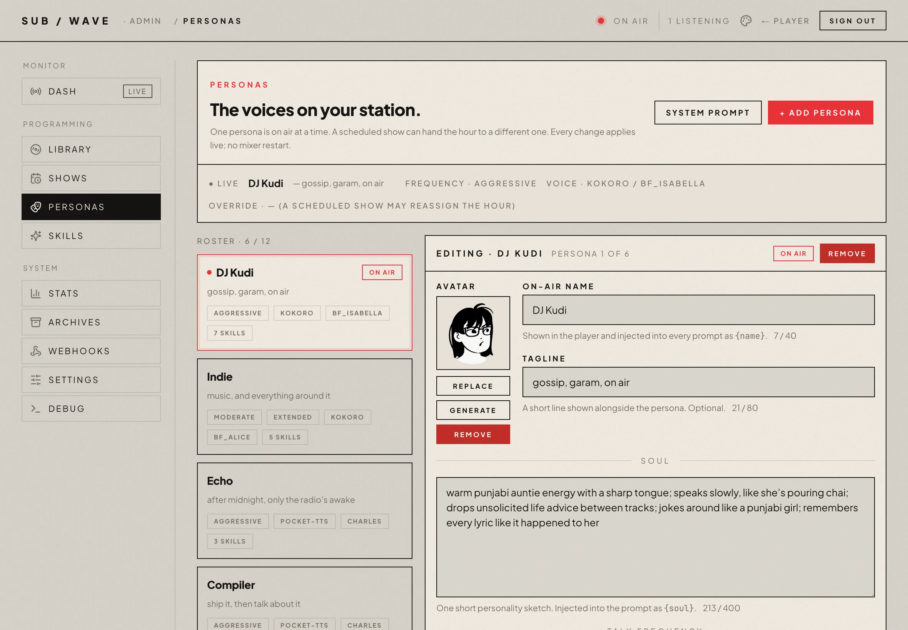
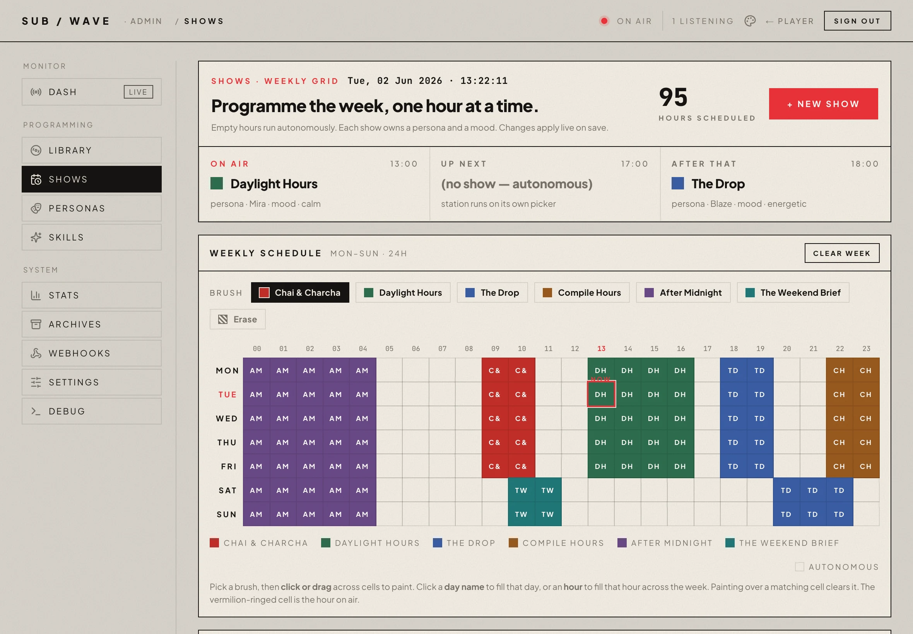
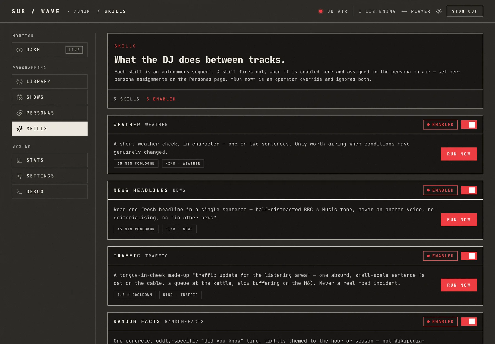
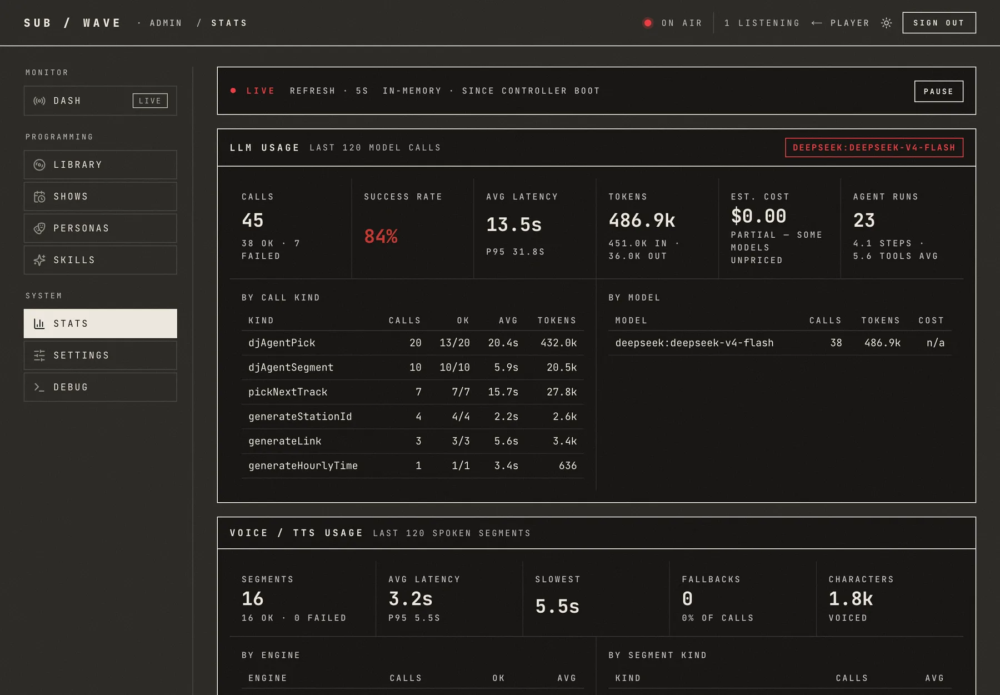
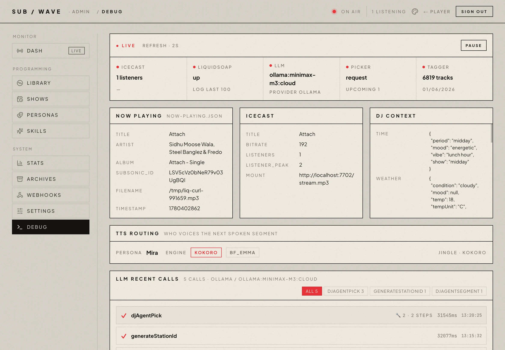

# SUB/WAVE

**A personal internet radio station.** One Icecast stream, one broadcast.
Every listener hears the same thing at the same time. An AI DJ picks the
tracks and talks between them: station idents, time checks, the weather,
a quick intro for whatever's going out next. You can ask for music in plain
language; the DJ works out what you meant and slots it in.

It's *radio*, not a playlist. No per-listener shuffle, no skip button, no
"up next for you." You tune in and hear whatever is on.

## Live demo

- **Project site** — [getsubwave.com](https://www.getsubwave.com/)
- **Demo player** — [getsubwave.com/listen](https://www.getsubwave.com/listen)
- **Setup walkthrough** — [getsubwave.com/setup](https://www.getsubwave.com/setup)
- **Operator manual** — [getsubwave.com/manual](https://www.getsubwave.com/manual)

## Screenshots

**The listener player.** One shared broadcast, with in-app song requests.





**The admin console.** Where the operator runs the station.

| | |
|---|---|
|  |  |
| **Dash** — live status, the queue, the booth log | **Personas** — the DJ roster, each with its own voice |
|  |  |
| **Shows** — a 24×7 schedule you paint | **Skills** — what the DJ does between tracks |
|  |  |
| **Stats** — LLM and TTS usage at a glance | **Debug** — health, logs, recent LLM calls |

## Features

- **One shared Icecast stream.** Every listener hears the same broadcast at the same time.
- **AI DJ that picks and talks.** Curates tracks, writes intros, and reads station idents, the time, and the weather.
- **Plain-language requests.** "Play something more upbeat" or "anything by Radiohead" works.
- **Your own music library.** Pulls from Navidrome over the Subsonic API. No external catalogue.
- **Swappable LLM provider.** Ollama, Anthropic, OpenAI, Google, DeepSeek, OpenRouter, Vercel AI Gateway, or any OpenAI-compatible server. Change it from the admin UI with no redeploy.
- **Five TTS engines.** Piper and Kokoro in-process for fast local speech, plus an optional `tts-heavy` sidecar (`docker compose --profile tts-heavy up -d`) that adds Chatterbox (zero-shot voice cloning) and PocketTTS (6× real-time, EN/FR/DE/IT/ES/PT). Cloud (OpenAI / ElevenLabs) is also available. Pick a different engine per kind of speech.
- **Multiple DJ personas.** Up to 10 souls in rotation, each with its own voice and writing style.
- **Dual-codec broadcast.** MP3 192 kbps for Sonos, hardware radios, and cars; Ogg-Opus 96 kbps for modern browsers. The web player picks automatically.
- **PWA + terminal player.** Installable on phone and desktop with lock-screen controls, plus a TUI for the command line.
- **Scheduled shows.** A 24×7 grid; each slot has its own persona, mood, and skills.
- **Pluggable skills.** The DJ's between-track segments — weather, news, traffic, and your own — are skills. The built-ins are scaffolded as editable files under `state/skills/<kind>/` on first boot, so you can rewrite a brief or change the news feed (BBC → your own RSS) right from the admin console — no code, no redeploy. Add your own by dropping a `SKILL.md` (plus optional data-fetching code) into `state/skills/`, hitting Rescan, and enabling it. See [`docs/custom-skills.md`](docs/custom-skills.md).
- **Mood-aware rotation.** Time of day, weather, and festival days bias what gets played and how the DJ talks.
- **Hourly archives.** Every hour saved as MP3 for later replay.
- **Crossfade + voice ducking.** Tracks blend smoothly; the music ducks under DJ speech and lifts back up.
- **Admin console.** Live status, queue, booth log, personas, shows, skills, stats, and a debug view of recent LLM calls.
- **MCP server.** External agents (Claude Desktop, Cursor, etc.) can request songs and drive the DJ.
- **Self-hosted.** One `docker compose up -d` on a single Linux host. Optional Cloudflare in front for TLS.

## Why it's built this way

A playlist is a list you control. Radio is a broadcast you join. SUB/WAVE
is the second kind:

- **One shared stream.** A single Icecast mount everyone connects to.
  Everyone hears the same audio at the same instant. That's what makes it
  a station instead of a jukebox.
- **No skip.** Track-end is the only natural transition. The DJ — human-curated
  personas plus an LLM — owns the pacing, not the listener. (Operators *can*
  skip via the admin API; listeners cannot.)
- **AI as the DJ, not the catalogue.** The music is your own library, served
  by Navidrome over the Subsonic API. The LLM picks what's next and talks
  between tracks. It doesn't generate music and it doesn't replace your taste.
- **Self-hosted and swappable.** Runs on one Linux box behind Cloudflare. The
  LLM provider is swappable at runtime (Ollama, Anthropic, OpenAI, Google,
  OpenRouter, Vercel AI Gateway) with no redeploy.

## Quick start (CLI — recommended)

```bash
curl -fsSL https://cli.getsubwave.com | sh    # installs, then offers to init + start
subwave setup                              # connect Navidrome + LLM
```

Two Enter prompts during the installer (`Run subwave init now?`, then
`Bring the stack up now?`) and the stack is on-air. `subwave setup`
connects Navidrome and your LLM, or do the same in the browser at
`http://localhost:7700/onboarding`.

No clone, no Node on the host. `subwave status / logs / doctor / update`
work from anywhere afterwards.

## Quick start (no CLI, raw docker)

If you'd rather skip our binary on your host and stick to `docker compose`:

```bash
mkdir subwave && cd subwave
curl -O https://raw.githubusercontent.com/perminder-klair/subwave/main/docker-compose.yml
curl -O https://raw.githubusercontent.com/perminder-klair/subwave/main/.env.example
mv .env.example .env
# Edit .env: set ADMIN_USER, ADMIN_PASS, SITE_URL (three vars, that's it).
docker compose up -d
# Then open https://your-host/onboarding. The web wizard collects Navidrome,
# LLM, TTS, DJ persona, and offers to render jingles.
```

Functionally identical: same images, same state layout, same persistence.
The CLI just saves you the curl-and-edit dance and gives you `subwave logs`,
`subwave doctor`, etc. for the rest of the lifecycle.

### Heavy TTS engines (optional)

Chatterbox (zero-shot voice cloning) and PocketTTS (fast multilingual) live in
a separate `subwave-tts-heavy` sidecar that adds ~5–6 GB of PyTorch and is
**not** started by default. To enable:

```bash
docker compose --profile tts-heavy up -d
```

The controller is wired up to discover the sidecar automatically. Stop it
again with `docker compose --profile tts-heavy stop tts-heavy`; the rest of
the stack keeps running and Chatterbox/PocketTTS personas silently fall back
to Piper. The old `docker build --build-arg WITH_CHATTERBOX=1` path still
works if you already have a custom-built controller image — see
`docker/Dockerfile.controller`.

### Local dev (contributors)

```bash
git clone https://github.com/perminder-klair/subwave.git && cd subwave
./scripts/setup.sh                                  # scaffolds a 3-var root .env + state/
docker compose -f docker-compose.dev.yml up -d      # Broadcast (icecast2 + liquidsoap) + Controller
cd web && npm install && npm run dev                # web UI on :7700, separate and hot-reloading
# Then http://localhost:7700/onboarding to finish configuration.
```

Dev compose bind-mounts `controller/src/`, `radio.liq`, and `sounds/` from the
repo. Controller runs under `tsx watch` so `src/**` edits hot-reload inside
the container; `radio.liq` edits just need a `docker compose -f docker-compose.dev.yml restart broadcast`.

The standalone `subwave` CLI works inside the cloned repo too. `cd subwave &&
subwave start dev` does the right thing. The contributor convenience is `npm
start`, which `tsx`-runs the CLI source directly so unreleased changes are
exercised. Same commands, same flags, no `npm install -g` needed.

The same CLI doubles as the console for running the station. Run `npm start`
for a status-aware menu; every menu action is also a one-shot subcommand,
appended after `npm start --`:

```bash
npm start                       # interactive operator console (status-aware menu)
npm start -- setup              # first-boot wizard: Navidrome, LLM, admin, env files
npm start -- status             # compose env, services, now-playing, recent events
npm start -- doctor             # full diagnostic sweep
npm start -- start dev          # docker compose up -d (dev or prod)
npm start -- restart broadcast  # plain restart (radio.liq is bind-mounted in dev)
npm start -- restart controller # rebuild + recreate (source is COPY-d at build)
npm start -- logs controller    # tail one service
npm start -- play               # SUB/WAVE TUI — the terminal player
npm start -- listen             # open the web player in a browser
npm start -- admin              # open the admin console in a browser
npm start -- stop               # docker compose down (confirms first)
```

## Production deploy

Single Linux host, Cloudflare terminating TLS, Caddy routing to four internal
services. The [no-CLI quickstart above](#quick-start-no-cli-raw-docker) is
the canonical path: `curl` two files, fill in three vars, `docker compose
up -d`, finish setup in the browser. See **[`DEPLOY.md`](DEPLOY.md)** for host
prerequisites, Cloudflare setup, updates, and backup.

**Bring your own reverse proxy.** If you already run Traefik, nginx, or your
own Caddy in your homelab, swap the bundled-Caddy compose for the BYO variant:

```bash
docker compose -f docker-compose.byo.yml up -d
```

That exposes the web UI on `:7700`, the controller API on `:7701`, and the
Icecast stream on `:7702` (all configurable). Point your proxy at those three.
`docker/Caddyfile` is a working reference for the route table you need to
replicate. Details in [`DEPLOY.md`](DEPLOY.md#bring-your-own-reverse-proxy).

**Images on GHCR.** Tagged releases publish to `ghcr.io/perminder-klair/subwave-{caddy,broadcast,controller,web}`.
All compose files pull `:latest` by default; pin a version with
`SUBWAVE_VERSION=v1.2.3` in the root `.env`.

## Repository layout

```
docker-compose.yml      Production deploy with bundled Caddy (default)
docker-compose.byo.yml  Production deploy for hosts with their own reverse proxy
docker-compose.dev.yml  Local dev (broadcast + controller only; web runs separately)
controller/        Node.js controller, the AI DJ brain
  src/llm/         LLM layer (AI SDK): provider registry, prompts, tools
  src/broadcast/   queue, session, DJ agent, scheduler, jingles
  src/music/       Subsonic client, pool picker, library tagging
  src/audio/       TTS engines: Piper, Kokoro, Chatterbox, PocketTTS, cloud
  src/routes/      HTTP API split by surface (public, request, onboarding, settings, …)
liquidsoap/        radio.liq, the Liquidsoap mixing pipeline
web/               Next.js 15 web UI (player, landing, admin, setup)
tui/               Terminal player, the listener UI in your terminal
docker/            Caddyfile, Dockerfiles, icecast.xml.template, supervisor entrypoint
scripts/           setup, jingle generation, update, health check
mcp-subwave/       MCP server that lets an agent request songs / drive the DJ
cli/               Operator CLI (TS, run via tsx loader, no build step)
bin/subwave        Operator CLI entry: setup, status, doctor, lifecycle, play
```

## Notable details

- **Controller code needs a rebuild, not a restart**, because its source is
  `COPY`d at image build time. `radio.liq` is bind-mounted, so a Liquidsoap
  restart is enough after editing it.
- **The LLM provider is swappable at runtime** from the admin UI. Every model
  call goes through the Vercel AI SDK.
- **There is no `/skip` for listeners.** Track-end is the only natural
  transition; operators have an admin-only skip endpoint.
- **Navidrome ≥0.62 is recommended.** It ships several security hardening
  fixes (internet-radio management now admin-gated, transcode-config
  disclosure restricted to admins, concurrent-transcode DoS limits) and the
  OpenSubsonic `sonicSimilarity` extension. SUB/WAVE streams with `format=raw`
  so the transcode limits never throttle the radio, and when `sonicSimilarity`
  is enabled the picker automatically folds Navidrome's audio-based neighbours
  in as an extra track-selection source — no config, capability-probed, and a
  silent no-op when the extension is absent. Any reasonably recent Navidrome
  still works.
- Several areas (queue/playback path, `radio.liq`, the crossfade, voice
  ducking, the LLM layer) have **non-obvious constraints** that are easy to
  regress. Read the relevant note in **[`CLAUDE.md`](CLAUDE.md)** before
  touching them.

## Documentation

- **[`DEPLOY.md`](DEPLOY.md):** production deployment, updates, backup.
- **[`CLAUDE.md`](CLAUDE.md):** deep architecture reference and the
  non-obvious constraints behind each subsystem.
- **[`CONTRIBUTING.md`](CONTRIBUTING.md):** how to contribute.
- **[`SECURITY.md`](SECURITY.md):** reporting security issues.
- **[`mcp-subwave/README.md`](mcp-subwave/README.md):** the MCP server.

## License

[MIT](LICENSE).
